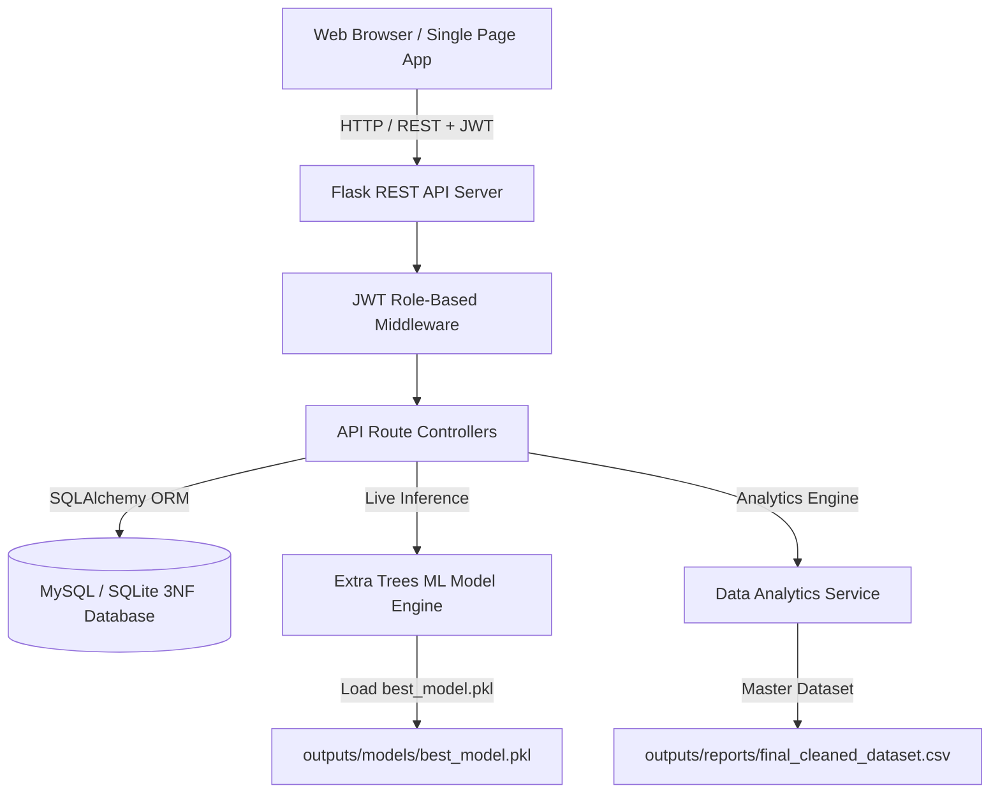

# PricePilot AI: Dynamic Pricing Optimization & Revenue Intelligence System

PricePilot AI is an enterprise-grade full-stack artificial intelligence application built for **Dynamic Pricing Optimization, Demand Forecasting, and E-Commerce Revenue Intelligence**. 

It combines a **production ML pipeline** (trained on 100,000+ e-commerce orders) with a **Flask REST API backend**, **JWT Role-Based Access Control (RBAC)**, **3NF Normalized Database Schema**, and a **Glassmorphism Single-Page Web Dashboard**.

---

## 🏛️ System Architecture



---

## 📁 Updated Project Directory Structure

```
Price-Pilot-AI/
├── web_app.py                  # Web Server Entry Point (http://127.0.0.1:5000)
├── app/                        # Flask Web Application Package
│   ├── __init__.py             # App Factory, DB & Blueprint Initialization
│   ├── config.py               # Application & JWT Configurations
│   ├── models.py               # 3NF Normalized SQLAlchemy Database Models
│   ├── auth.py                 # JWT Tokens, Password Hashing & Role Decorators
│   ├── api/                    # REST API Blueprints
│   │   ├── auth_routes.py      # Auth Endpoints (/register, /login, /refresh, /profile)
│   │   ├── pricing_routes.py   # AI Inference (/predict-price, /forecast-demand, /optimize-price)
│   │   ├── dashboard_routes.py # Dashboard KPIs & Visualizations
│   │   ├── product_routes.py   # Product CRUD & AI Price Recommendation
│   │   ├── order_routes.py     # Order Management APIs
│   │   └── analytics_routes.py # Model Performance & Feature Importance APIs
│   ├── services/               # Business Logic Services
│   │   ├── ml_service.py       # ML Model Loader & Inference Engine
│   │   └── data_service.py     # Analytics & Aggregation Engine
│   ├── static/                 # Frontend Web Assets
│   │   ├── css/style.css       # Modern Glassmorphism Styling
│   │   └── js/                 # API Client, ApexCharts Engine & SPA Logic
│   └── templates/
│       └── index.html          # Responsive Single Page Web Dashboard
├── tests/                      # Automated Pytest Suite
│   ├── conftest.py             # Test Fixtures & In-Memory DB Setup
│   ├── test_auth.py            # Authentication & Role Tests
│   ├── test_api.py             # REST API Tests
│   └── test_ml_inference.py    # Price Prediction & ML Inference Tests
├── src/                        # Modular ML Pipeline Package
│   ├── data_loader.py          # Olist CSV Auto-loader
│   ├── preprocessor.py         # Cleaning & Merging Logic
│   ├── feature_engineering.py  # CLV, Delivery Delay & Seasonal Features
│   ├── feature_selection.py   # MI, RF & RFE Feature Selectors
│   ├── models.py               # 10 Regression Models Wrappers
│   ├── evaluation.py          # Metric Evaluation Routines
│   └── pipeline.py            # Full ML Pipeline Orchestrator
└── outputs/                    # Visual & Serialized Deliverables
    └── models/best_model.pkl   # Serialized Best Regressor Model (Extra Trees)
```

---

## 🗄️ Database Schema (3NF Normalized)

The database schema is fully normalized in **Third Normal Form (3NF)** with strict foreign keys, indexes, and constraints:

1. **`users`**: User account management with role authorization (`Admin`, `Pricing Manager`, `Business Analyst`).
2. **`categories`**: Product category taxonomy and translations.
3. **`products`**: Product catalog with dimensions, weights, and current prices.
4. **`sellers`**: E-commerce sellers and location prefixes.
5. **`customers`**: Customer profiles and state geolocation metadata.
6. **`orders`**: Master purchase order records and timestamp tracking.
7. **`order_items`**: Line items linking orders, products, sellers, prices, and freight values.
8. **`pricing_history`**: Audit trail of manual and AI price changes.
9. **`predictions`**: Log of ML model inferences, input feature vectors, and confidence scores.
10. **`revenue_analytics`**: Aggregated period revenue statistics.
11. **`demand_forecasts`**: Daily projected unit demand.
12. **`audit_logs`**: System audit trail of security and API activity.

---

## 🔌 Complete REST API Specification

### 🔑 Authentication API (`/api/auth`)
| Method | Endpoint | Description | Access |
|---|---|---|---|
| `POST` | `/api/auth/register` | Register new user account | Public |
| `POST` | `/api/auth/login` | Authenticate user & receive JWT tokens | Public |
| `POST` | `/api/auth/logout` | Revoke user session | Protected |
| `POST` | `/api/auth/refresh` | Obtain new access token using refresh token | Public |
| `GET` | `/api/auth/profile` | Fetch authenticated user profile | Protected |
| `PUT` | `/api/auth/profile` | Update account profile details | Protected |

### 🤖 AI Pricing & ML Inference API (`/api/pricing`)
| Method | Endpoint | Description | Access |
|---|---|---|---|
| `POST` | `/api/pricing/predict-price` | Predict optimal price using Extra Trees ML model | Protected |
| `POST` | `/api/pricing/forecast-demand` | Generate 30-day demand forecast | Protected |
| `POST` | `/api/pricing/optimize-price` | Compute price elasticity curve and maximum profit point | Admin / Pricing Manager |

### 📊 Dashboard & Intelligence API (`/api/dashboard`)
| Method | Endpoint | Description | Access |
|---|---|---|---|
| `GET` | `/api/dashboard/summary` | Get 8 Core KPI Card metrics | Public |
| `GET` | `/api/dashboard/monthly-revenue` | Get 2017 vs 2018 monthly revenue trends | Public |
| `GET` | `/api/dashboard/weekly-revenue` | Get weekly order & revenue distribution | Public |
| `GET` | `/api/dashboard/top-products` | Get top revenue-generating product categories | Public |
| `GET` | `/api/dashboard/top-sellers` | Get top fulfilling sellers | Public |
| `GET` | `/api/dashboard/customer-insights` | Get customer state breakdown & payment stats | Public |

### 📦 Product Management API (`/api/products`)
| Method | Endpoint | Description | Access |
|---|---|---|---|
| `GET` | `/api/products` | List paginated products with search filter | Public |
| `POST` | `/api/products` | Create new product | Admin / Pricing Manager |
| `PUT` | `/api/products/<id>` | Update product details & price | Admin / Pricing Manager |
| `DELETE` | `/api/products/<id>` | Delete product from catalog | Admin |

---

## ⚡ Quick Start & Running Instructions

### 1. Install Dependencies
```bash
pip install -r requirements.txt
# Or install core full-stack dependencies directly:
pip install flask flask-sqlalchemy flask-bcrypt pyjwt flask-cors pytest pandas numpy scikit-learn xgboost lightgbm catboost
```

### 2. Launch Web Application & Dashboard
```bash
python web_app.py
```
Open your browser and navigate to: **`http://127.0.0.1:5000`**

Default test accounts initialized automatically:
- **Admin**: `admin@pricepilot.ai` / `admin123`
- **Pricing Manager**: `pricing@pricepilot.ai` / `pricing123`
- **Business Analyst**: `analyst@pricepilot.ai` / `analyst123`

### 3. Run Automated Tests
```bash
python -m pytest tests/ -v
```

---

## 📊 Machine Learning Regressor Rankings

| Rank | Model Name | R² Score | CV Score (R²) | RMSE (BRL) | MAE (BRL) |
|---|---|---|---|---|---|
| **1** | **Extra Trees Regressor** | **0.9904** | **0.9610** | **20.46** | **4.76** |
| 2 | Gradient Boosting Regressor | 0.9893 | 0.9335 | 21.58 | 5.56 |
| 3 | Lasso Regression | 0.9874 | 0.9927 | 23.35 | 5.86 |
| 4 | Linear Regression | 0.9874 | 0.9927 | 23.37 | 5.87 |
| 5 | Ridge Regression | 0.9874 | 0.9927 | 23.37 | 5.87 |
| 6 | Random Forest Regressor | 0.9855 | 0.9507 | 25.09 | 6.55 |
| 7 | Decision Tree Regressor | 0.9840 | 0.8150 | 26.32 | 6.42 |
| 8 | XGBoost Regressor | 0.9709 | 0.8628 | 35.55 | 11.23 |
| 9 | LightGBM Regressor | 0.9703 | 0.8696 | 35.89 | 11.66 |
| 10 | CatBoost Regressor | 0.9679 | 0.8871 | 37.29 | 12.04 |
